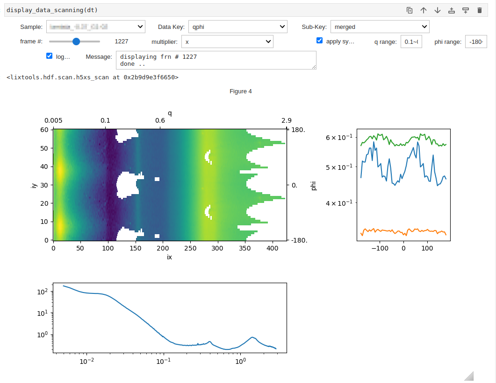
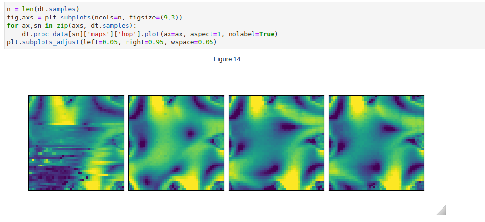

In the data processing workflow for scanning mapping measurements, a wide variety anf large volume of data attributes may need to be extractred and analyzed. Therefore new classes, `h5xs_an` and `h5xs_scan`, are created to provide more flexibility. A new hdf file is created for the processed data, while the raw data are kept seperately in their original hdf files. The processed data are organized in a `proc_data` dictionary, orgnaized in three levels:

* *Sample name.* 
  This could be the sample name defined in the scan when collecting the raw data, or `overall`, if the final results are assembled from multiple raw data files.     
<br>

* *Data key.*
  Here are a few already used in `lixtools`: 

    `Iqphi` for the 2D intensity map as a function of scattering vector $q$ and azimuthal angle $\phi$; 
    
    `Iq` for azimuhtally averaged intensity; 
    
    `attrs` for per-frame attributes extracted from the data; 
    
    `maps` for strcutral maps reformated from `attrs` based on the scan parameters; 
    
    `tomo` for tomograms reconstructed from `maps`.
<br>    
  
* *Sub key.* 
  For istance, `merged` and `subtracted` for `Iq`, `transmission` and `incident` for `attrs`.


Here's an example of typical code for data proessing. First we instantatiate the `h5xs_scan` object: 

```python
rn = "time_series1"
dt = h5xs_scan(f"{rn}_an.h5", [de.detectors, qgrid], Nphi=61, pre_proc="2D", 
               replace_path={"legacy": "proposals"})
```

`de` defines the detectors as in solution scattering. `Nphi` specifies the number of azimuthal
angles (evenly spaced) to be used for pre-processing that generates the $q$-$\phi$ maps, as sepcified by `pre_proc`. The `replace_path` argument
is necessary since currently the hdf files for raw data must be moved to the proposal directory manually.


Next we connect the `h5xs_scan` to the raw data files and import the metadata from the scans that produced the raw data:
```python
for fn in sorted(glob.glob(f"{rn}-*.h5")):
    dt.import_raw_data(fn, force_uniform_steps=True, prec=0.001, debug=True)
```

Now we can perform the pre-processing, using multi-processing:
```python
dt.process(N=8, debug=True)
```

Once the $q$-$\phi$ maps are produced, the attributes can be generated and reorganized into maps:
```python
for sn in dt.samples:
    dt.extract_attr(sn, "int_saxs", get_roi, "qphi", "merged", 
                    qphirange=[0.02, 0.05, -180, 180])
    dt.extract_attr(sn, "hop", hop, "qphi", "merged", xrange=[0.04, 0.06])
    
dt.make_map_from_attr(save_overall=False, 
                      attr_names=["transmitted", "absorption", "int_saxs", "hop"], 
                      correct_for_transsmission=False)
```
The `extract_attr()` method extracts an attribute from the processed data under sample name `sn`, data key `qphi`, 
and sub key `merged`, using the the user-specified/defined function (`get_roi` or `hop`), whose first argument must
be the input data, with the specified keyword arguments (`qphirange` or `xrange`). 

During and after processing, the data can be visualized using a GUI:

Or the data can plotted using `matplotlib`:

In this examples, the 4 measurements('samples') correspond to 4 data points in time as a flow field is established. In some cases, 
these measurements could correspond to parts of a larger sample, the individual maps can then be merged based on the 
coordinates in the metadata from the scans.
