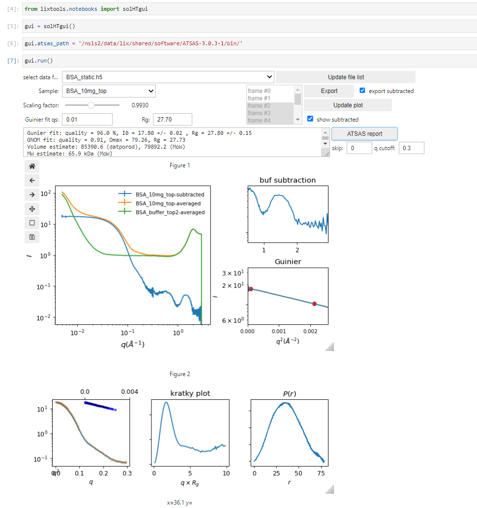
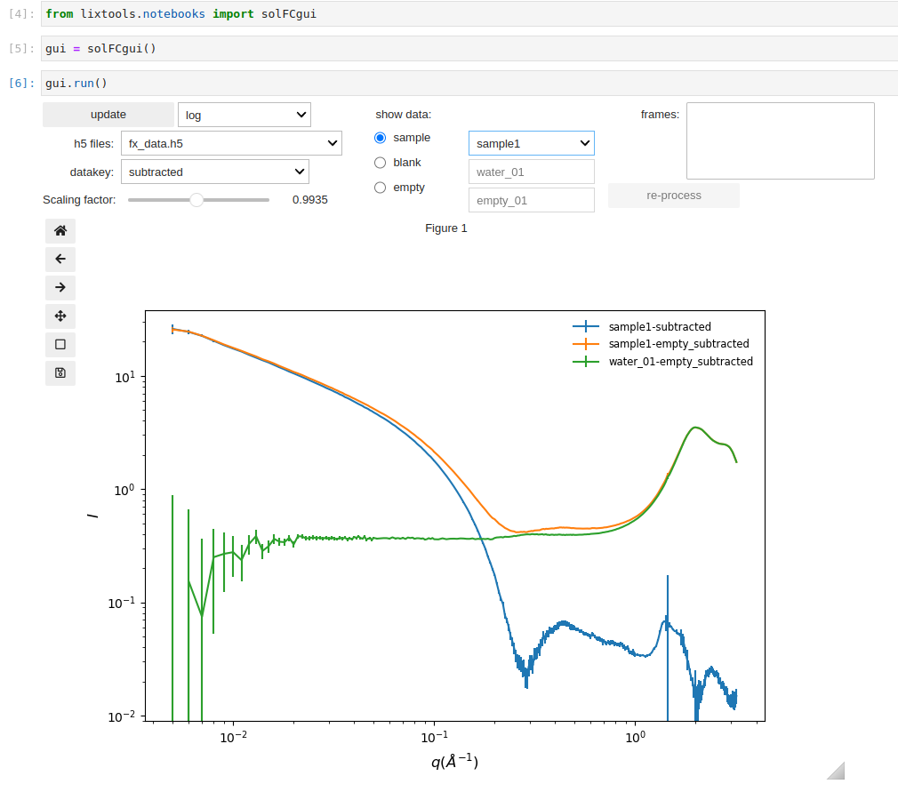
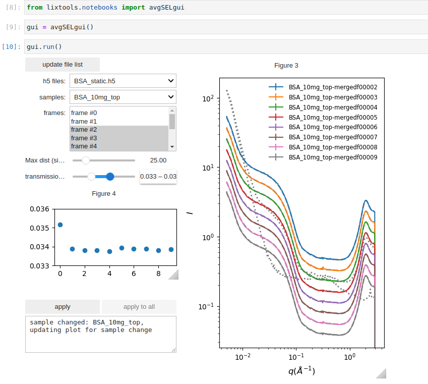
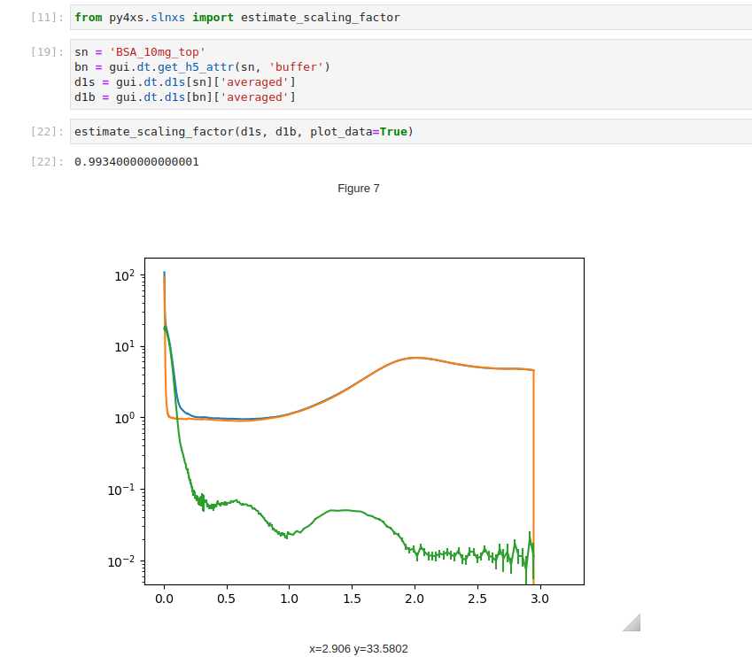
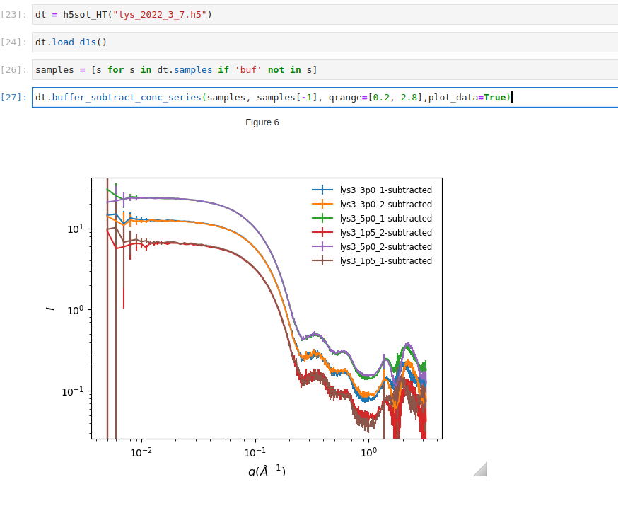

#
The descriptions here are applicable for all measurements in which the scattering data is isotropic and background subrtaction may be necessary. At LiX we support these measumsurements using two diffrent data collection methods, typically referred to as the flowcell measurements and the fixed cell measurements. 

## Flowcell measurements
The sample is flowed from a PCR tube in the sample holder through the flowcell, as scattering data are recorded. The instrumentation for automated measurements is described [here](https://onlinelibrary.wiley.com/iucr/doi/10.1107/S1600577520002362) . The samples in the holder must be specified in a spreadsheet to facillitate automated data collection and processing. Further information can be found on the LiX beamline [wiki](https://wiki-nsls2.bnl.gov/beamline16ID/index.php?title=Beamline_16ID:Main_Page) .  

This is typically used for protein samples in aqueous solution. A matching buffer must also be measured, in the flow channel to ensure reproducible sample thickness and background scattering. Only buffer scattering is subtracted, based on the intensity of the water peak. It is assumed that the contribution of empty cell scattering is minimal, once the buffer scattering subtracted. For this assumption to be valid, the sample and the buffer should be measured close in time, ideally back-to-back, to avoid change in backgroudn scattering due to accumulation of materials on the flowcell window. Also the protein concentration (volume fraction) should be reasonably low. See our workbench presentation more a more detailed discussion.

After data collection is completed for each sample holder, data from all samples are packed into a hdf5 file. As automated data processing takes place, the processed data are added to the same hdf5 file. And a html data processing report is produced. The process typically consists of the following steps:

<h6> Define the python instance that correspond to the dataset</h6>
```python
from lixtools.hdf.sol import h5sol_HT
from lixtools.samples import get_sample_dicts

dt = h5sol_HT(h5_file_name, (de.detectors, de.grid))
```
Here the class `h5sol_HT` is specific to the flowcell measurements. `de` should be an instance of `DetectorConfig` (see docs for [py4xs](detector.md)). Utilities under `py4xs` and reference data provided by the beamline should be used to verify the validity of `de`. 

<h6> Assign the sample-buffer relationship and perform processing </h6>
```python
sd = get_sample_dicts(spreadSheet, holderName, use_flowcell=True)
dt.assign_buffer(sd['buffer'])
dt.process(sc_factor='auto', debug='quiet')
```
The last line performs azimuthal averaging, frame selection, and buffer subtraction. These can be done separately. Refer to the code under `lixtools`.

<h6> Generate processing report</h6>

```python
from lixtools.atsas import gen_report

gen_report(h5_file_name)
```
This will produce a html report for all samples in the hdf file. Things could go wrong during automated data processing. The processing report provides an overview of the prosessing results and provide a guide on whether frame selection for averaging and scaling for buffer subtraction need to be adjusted. These adjustment can be done by using the data visualization GUI or by code.  



## Fixed cell measurements
Alternatively, the sample can be scanned such that the x-ray beam moves across the sample as scattering data are collected. The sample will need to be pre-loaded into a multi-position sample holder. We support multiple holder formats. Again, consult the beamline [wiki](https://wiki-nsls2.bnl.gov/beamline16ID/index.php?title=Beamline_16ID:Main_Page) regarding the sample holders and the required spreadsheet for automated data processing. With fixed cell measurements it is important to specify how empty cell scattering should be subtracted. 

The data processing workflow is slightly different from flowcell measurements:

```python
from lixtools.hdf.sol import h5sol_fc
from lixtools.samples import get_sample_dicts

dt = h5sol_fc(f'{sample_hn}.h5', [de.detectors, de.qgrid])

sd = get_sample_dicts(spreadSheet, holderName)
dt.assign_empty(sd['empty'])
dt.assign_buffer(sd['buffer'])

dt.process(rebin_data=True, trigger="ss_y", sc_factor='auto')
```

A few of important differences: (a) the `h5sol_fc` class should be used; (b) both buffer and empty cell need to be specified; (c) the motor used to scan the sample should be specified. Again, a GUI is provided for tweaking the processing parameters and data visualization. 


The ATSAS report is not included since the data often contain the contribution from a structure factor due to interactions between the particles in solution, or the structure cannot be considered as particles. Instead, the data can be exported into a NXcanSAS file for analysis in `sasview`:
```python
gui.dt.export_NXcanSAS()
```

## Common utilities

Both `h5sol_HT` and `h5sol_HT` are derived from the `h5xs` class from `py4xs`, and therefore can methods described under `h5xs` docs. For instance, once the data processing is done once, the 1D data can be reloaded using `load_d1s()`, visualized using `plot_d1s()`, compared different samples in the same file using `compare_d1s()`, and exported the 1D data using `export_d1s()`.  

#### Frame selection
In some situations, the scattering patterns (typically 10-20 frames) collected from the same sample may be different. This can happen when there are bubbles when the sample is loaded into the flow cell, or if the is not enough sample to cover the entire scan range in the fixed cell. It is therefore necessary to exclude the frames that do not correpond to the beam fully illuminating the sample. While simple similarity comparison is often sufficinet, it is more reliable to also check the x-ray transmission through the sample, which is expected to be higher is the beam-illuminated volume is not completely filled with sample. This GUI below is useful to identify what the threshold values are for transmission and similarity (max pairwise distance), so that they can be applied in automated frame selection.


#### Scaling factor estimate
As discussed [here](https://journals.iucr.org/s/issues/2021/04/00/ye5004/), subtraction of the scattering from aquesous buffer can be performed based on the intensity of the water peak, which automatically takes into account the volumn fraction occupied by the solute molecules. However, an additional scaling factor is still necessary and need to be fine tuned. This scaling factor can be estiamted using the `estimate_scaling_factor()` function.  


For a concentration series, the scaling factor can be adjusted in coordination, assuming that the shape of the high-q data should be independent of the concentration after the subtraction .

