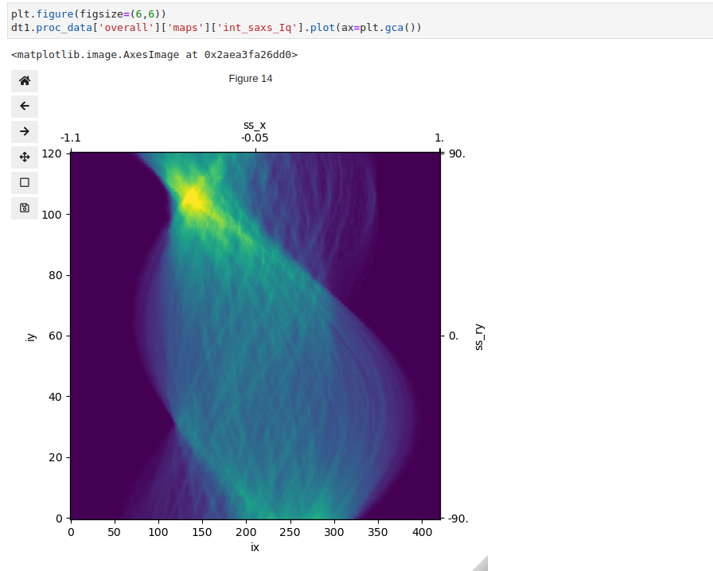
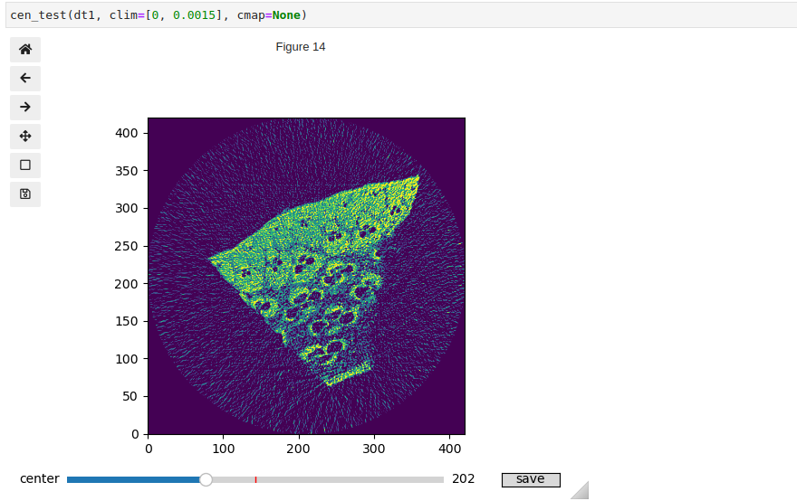

Using the same data processing workflow for scanning mapping, sinograms can be produced from the tomographic dataset. 

Before tomographic reconstruction using [tomopy](https://tomopy.readthedocs.io/en/stable/), the rotation center may need to be find manually:


```python
rot_cen = dt.get_h5_attr("overall/maps", "rot_cen")
dt1.calc_tomo_from_map(attr_names=map_keys, 
                       algorithm="pml_hybrid", num_iter=100, center=rot_cen)
calc_CI(dt, ref_key="int_cell_Iq", ref_cutoff=0.04)
```
Note that some tomograms (e.g. cellulose crystallinity index in the code above)
are calculated from other tomograms.

