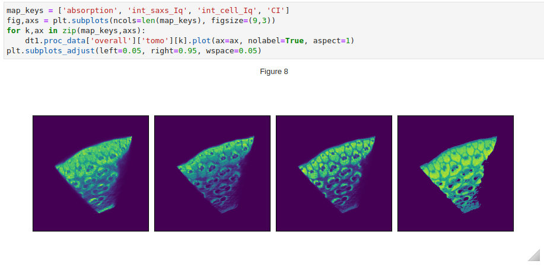

Using the same data processing work-flow for scanning mapping, sinograms can be produced from the tomographic dataset. An example is given below. The coordinates are the sample position (ss_x) and the projection angle (ss_ry). 
<br>


Before tomographic reconstruction using [tomopy](https://tomopy.readthedocs.io/en/stable/), the rotation center may need to be find manually:
<br>


```python
rot_cen = dt.get_h5_attr("overall/maps", "rot_cen")
dt1.calc_tomo_from_map(attr_names=map_keys, 
                       algorithm="pml_hybrid", num_iter=100, center=rot_cen)
calc_CI(dt, ref_key="int_cell_Iq", ref_cutoff=0.04)
```
Note that some tomograms (e.g. for cellulose crystallinity index, or CI)
are calculated from other tomograms. There are therefore no corresponding sinograms.


